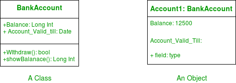
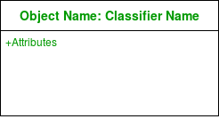
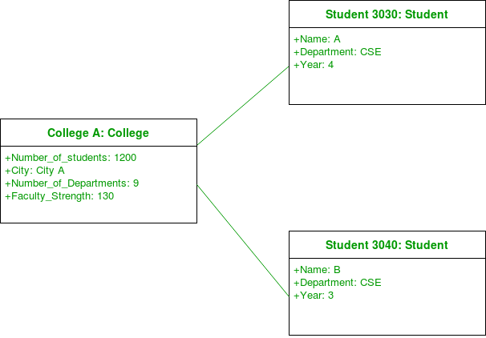
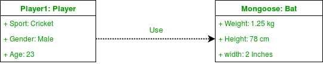
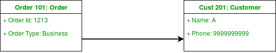
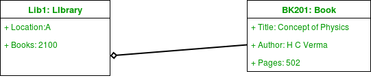
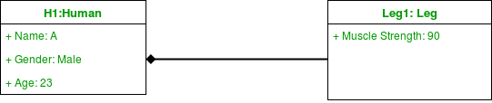

对象图可以被看做系统中实例及其之间存在关系的快照。由于对象图描述了对象实例化的过程，我们能够去研究在特定时刻系统的行为。

对象图对于描绘和理解系统功能需求至关重要。换句话说，“UML中的对象图，是一个可以展现在特定时间整个/部分建模系统视图结构的图”

# **对象图和类图的区别**

对象图和类图类似，只不过其展示了系统中类的实例。我们利用类图来描述实际的分类器及其关系。另一方面，对象图表示类的特定实例以及它们在某个时间点之间的关系。

# **什么是分类器（classifier）**

在UML中，分类器是指一组元素，这些元素具有一些共同的特征，例如方法，属性和操作。可以将分类器视为抽象的元类，它为具有共同的静态和动态特征的一组实例绘制边界。例如，我们将类，对象，组件或部署节点称为UML中的分类器，因为它们定义了一组公共属性。

对象图是一种使用类似于类图的符号结构图。我们能够通过实例化分类器来设计对象图。

对象图使用现实世界中的示例来描述特定时间点上系统的性质和结构。由于我们能够使用对象内可用的数据，因此对象图提供了对象之间存在关系的更加清晰的视图。

# **对象图中用到的符号**

1. 对象或示例规范-当我们实例化系统中的分类器时，创建的对象表示系统中存在的实体。我们可以通过创建多个实例来表示对象随时间的变化。我们使用矩形表示对象图中的对象。对象通常链接到对象图中的其他对象。

   

   例如-下图中，两个Student类的对象被链接到College类的对象上。

   

2. 链接-我们使用链接去表示两个对象之间的关系

   

   我们在每条链接末端的表示出参与者的数量。在两个分类器之间我们使用association术语来表示它们之间的关系。链接用来指定两个实例或对象之间的关系。我们使用实线表示两个对象直接的链接

   | NOTATION |    MEANING    |
   | :------: | :-----------: |
   |   0..1   |  Zero or one  |
   |    1     |   One only    |
   |   0..*   | Zero or more  |
   |    *     | Zero or more  |
   |   1..*   |  One or more  |
   |    7     |  Seven only   |
   |   0..2   |  Zero or two  |
   |   4..7   | Four to seven |

3. 依赖关系-我们使用依赖关系来表示一个元素依赖于另外一个元素

   

   类图，组件图，部署图和对象图使用依赖关系。依赖关系用于描述系统中依赖实体和独立实体之间的关系。一个元素的定义或者结构的任何更改都可能导致另外一个元素的变化。这是两个对象之间的单向关系。

   依赖关系是用关键字指定的各种类型（有时在尖括号中）。

   Abstraction,Binding, Realization, Substitution and Usage是UML中使用依赖关系的类型。

   例如-下图中，Player类的对象依赖（或者使用）Bat类的对象。

   

4. 关联- 关联关系是两个对象（或者类）之间的引用关系

   

   每当一个对象使用另一个对象时，就称为关联。当一个对象引用另一个对象的成员时，我们使用关联。关联可以是单向或双向的。我们使用箭头表示关联。

   例如-Order类的对象与Customer类的对象相关联

   

5. 聚合-表示“has a”的关系

   

   聚合是一种特殊形式的关联形式；聚合比普通的关联关系更加具体。它是代表整体或部分关系的关联。这是一种父子关系，但不是继承。当所包含对象的生命周期与容器对象的生命周期之间依赖性不强时，就会发生聚合。

   

   例如-图书馆和书籍之间的聚合关系。图书馆拥有书，或者书籍是图书馆的一部分。书籍的存在独立于图书馆的存在。实现的时候，聚合和组合没有太大区别。我们在包含对象上使用一个空心的菱形，并用一条线将其连接到被包含的对象。

6. 组合-关联关系的一种，其中各子项不能独立存在

   

   组合也是一种特殊类型的关联。其也是一种父子关系，但不是继承。考虑一个男孩Gurkaran的例子：Gurkaran有腿和胳膊组成。在这里，Gurkaran与他的腿和手臂有着组合关系。他的腿和胳膊不能独立于其父对象而存在。因此，无论何时，我们都会使用一种组合关系来描述不可能独立存在的孩子对象。我们在包含对象上使用实心菱形，并用一条线将其连接到被包含对象上。

   

   例如-在下面的图中，我们看Bank1。这里一个账户在没有Bank存在的情况下是不可能存在的。

   

# 关联和依赖的区别

关联和依赖的使用我们经常会搞混。造成这种混乱的原因是在UML1中使用了瞬态链接。现在，元模型在UML2中的处理方式有所不同，这个问题已经得到了解决。

系统中存在大量的依赖。我们仅代表对于理解系统而言必不可少的内容。我们需要了解，每个关联都暗含着依赖关系。但是，我们不倾向于单独绘制它。关联暗含着的依赖关系和泛化有些相似。

# 怎样去绘制对象图

1. 绘制系统所需的所有类图
2. 确定需要系统快照的关键时间点
3. 确定涵盖系统关键功能的对象
4. 识别绘制的对象之间的关系

# 对象图的使用

* 使用原型实例和真实数据对系统的静态设计（类似于类图）或结构进行建模
* 帮助我们了解系统应该提供给用户的功能
* 了解对象之间的关系
* 可视化，记录，构造和设计一个静态框架，该静态框架显示对象实例及其在系统动态生命周期中的关系。
* 通过将对象图用作特定的测试用例，验证类图的完整性和准确性
* 发现特定实例之间的事实和依赖关系，并描绘分类器的特定实例。