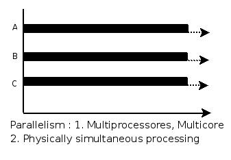
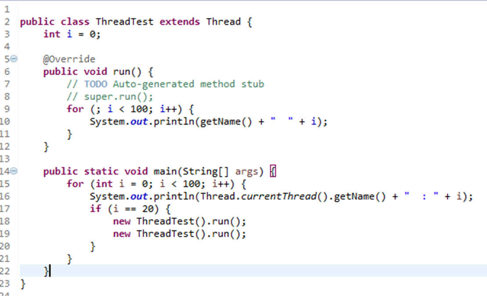

## 线程和进程的概念

### 多道程序设计

多道程序设计技术之前，多个程序串行执行，因此为了CPU的利用率，并且提高系统效率，引入多道程序设计概念；多道程序设计允许多个程序同时进入内存并执行，为了描述这样的执行过程引入了进程的概念

(下面几个问题摘自知乎:https://zhuanlan.zhihu.com/p/31444793)

**1、什么是多道程序系统？**

多道程序系统是在计算机内存中同时存放几道相互独立的程序，使它们在管理程序控制之下，相互穿插的运行 **(系统由一个程序转而运行另一个程序时需要使用中断机构中断正在运行的程序)** 。 两个或两个以上程序在计算机系统中同处于开始和结束之间的状态，这就称为多道程序系统。其技术运行的特征：多道、宏观上**并行**、微观上**串行**。

**2、在多道程序设计系统中，如何理解“内存中的多个程序的执行过程交织在一起，大家都在走走停停”这样一个现象？**

答：在多道程序设计系统中，内存中存放多个程序，它们以交替的方式使用CPU。因此，从宏观上看，这些程序都开始了自己的工作。但由于CPU只有一个，**在任何时刻CPU只能执行一个进程程序**。所以这些进程程序的执行过程是交织在一起的。也就是说，从微观上看，每一个进程一会儿在向前走，一会儿又停步不前，处于一种“走走停停”的状态之中。

3、**什么是“多道程序设计”技术？它对操作系统的形成起到什么作用？**

答：所谓“多道程序设计”技术，即是通过软件的手段，允许在计算机内存中同时存放几道相互独立的作业程序，让它们对系统中的资源进行“共享”和“竞争”，以使系统中的各种资源尽可能地满负荷工作，从而提高整个计算机系统的使用效率。基于这种考虑，计算机科学家开始把CPU、存储器、外部设备以及各种软件都视为计算机系统的“资源”，并逐步设计出一种软件来管理这些资源，不仅使它们能够得到合理地使用，而且还要高效地使用。具有这种功能的软件就是“操作系统”。所以，“多道程序设计”的出现，加快了操作系统的诞生。

4、**为什么说批处理多道系统能极大地提高计算机系统的工作效率？**
　　① 多道作业并行工作，减少了处理器的空闲时间。
　　② 作业调度可以合理选择装入主存储器中的作业，充分利用计算机系统的资源。
　　③ 作业执行过程中不再访问低速设备，而直接访问高速的磁盘设备，缩短执行时间。
　　④ 作业成批输入，减少了从操作到作业的交接时间。

#### Multiprogramming, multitasking, multithreading and multiprocessing的区别

(https://www.geeksforgeeks.org/difference-between-multitasking-multithreading-and-multiprocessing/)

1. **Multiprogramming –** A computer running more than one program at a time (like running Excel and Firefox simultaneously).
2. **Multiprocessing –** A computer using more than one CPU at a time.
3. **Multitasking –** Tasks sharing a common resource (like 1 CPU).
4. **Multithreading** is an extension of multitasking.

##### 1. Multi programming –

In a modern computing system, there are usually several concurrent application processes which want to execute. Now it is the responsibility of the Operating System to manage all the processes effectively and efficiently.
One of the most important aspects of an Operating System is to multi program.
In a computer system, there are multiple processes waiting to be executed, i.e. they are waiting when the CPU will be allocated to them and they begin their execution. These processes are also known as jobs. Now the main memory is too small to accommodate all of these processes or jobs into it. Thus, these processes are initially kept in an area called job pool. This job pool consists of all those processes awaiting allocation of main memory and CPU.
CPU selects one job out of all these waiting jobs, brings it from the job pool to main memory and starts executing it. The processor executes one job until it is interrupted by some external factor or it goes for an I/O task.

**Non-multi programmed system’s working –**

- In a non multi programmed system, As soon as one job leaves the CPU and goes for some other task (say I/O ), the CPU becomes idle. The CPU keeps waiting and waiting until this job (which was executing earlier) comes back and resumes its execution with the CPU. So CPU remains free for all this while.
- Now it has a drawback that the CPU remains idle for a very long period of time. Also, other jobs which are waiting to be executed might not get a chance to execute because the CPU is still allocated to the earlier job.
  This poses a very serious problem that even though other jobs are ready to execute, CPU is not allocated to them as the CPU is allocated to a job which is not even utilizing it (as it is busy in I/O tasks).
- It cannot happen that one job is using the CPU for say 1 hour while the others have been waiting in the queue for 5 hours. To avoid situations like this and come up with efficient utilization of CPU, the concept of multi programming came up.

The main idea of multi programming is to maximize the CPU time.
**Multi programmed system’s working –**

- In a multi-programmed system, as soon as one job goes for an I/O task, the Operating System interrupts that job, chooses another job from the job pool (waiting queue), gives CPU to this new job and starts its execution. The previous job keeps doing its I/O operation while this new job does CPU bound tasks. Now say the second job also goes for an I/O task, the CPU chooses a third job and starts executing it. As soon as a job completes its I/O operation and comes back for CPU tasks, the CPU is allocated to it.
- In this way, no CPU time is wasted by the system waiting for the I/O task to be completed.
  Therefore, the ultimate goal of multi programming is to keep the CPU busy as long as there are processes ready to execute. This way, multiple programs can be executed on a single processor by executing a part of a program at one time, a part of another program after this, then a part of another program and so on, hence executing multiple programs. Hence, the CPU never remains idle.

In the image below, program A runs for some time and then goes to waiting state. In the mean time program B begins its execution. So the CPU does not waste its resources and gives program B an opportunity to run.

##### **2. Multiprocessing –**

In a uni-processor system, only one process executes at a time.
Multiprocessing is the use of two or more CPUs (processors) within a single Computer system. The term also refers to the ability of a system to support more than one processor within a single computer system. Now since there are multiple processors available, multiple processes can be executed at a time. These multi processors share the computer bus, sometimes the clock, memory and peripheral devices also.

**Multi processing system’s working –**

- With the help of multiprocessing, many processes can be executed simultaneously. Say processes P1, P2, P3 and P4 are waiting for execution. Now in a single processor system, firstly one process will execute, then the other, then the other and so on.
- But with multiprocessing, each process can be assigned to a different processor for its execution. If its a dual-core processor (2 processors), two processes can be executed simultaneously and thus will be two times faster, similarly a quad core processor will be four times as fast as a single processor.

**Why use multi processing –**

- The main advantage of multiprocessor system is to get more work done in a shorter period of time. These types of systems are used when very high speed is required to process a large volume of data. Multi processing systems can save money in comparison to single processor systems because the processors can share peripherals and power supplies.
- It also provides increased reliability in the sense that if one processor fails, the work does not halt, it only slows down. e.g. if we have 10 processors and 1 fails, then the work does not halt, rather the remaining 9 processors can share the work of the 10th processor. Thus the whole system runs only 10 percent slower, rather than failing altogether.

Multiprocessing refers to the hardware (i.e., the CPU units) rather than the software (i.e., running processes). If the underlying hardware provides more than one processor then that is multiprocessing. It is the ability of the system to leverage multiple processors’ computing power.

**Difference between Multi programming and Multi processing –**

- A System can be both multi programmed by having multiple programs running at the same time and multiprocessing by having more than one physical processor. The difference between multiprocessing and multi programming is that Multiprocessing is basically executing multiple processes at the same time on multiple processors, whereas multi programming is keeping several programs in main memory and executing them concurrently using a single CPU only.
- Multiprocessing occurs by means of parallel processing whereas Multi programming occurs by switching from one process to other (phenomenon called as context switching).

##### **3. Multitasking –**

As the name itself suggests, multi tasking refers to execution of multiple tasks (say processes, programs, threads etc.) at a time. In the modern operating systems, we are able to play MP3 music, edit documents in Microsoft Word, surf the Google Chrome all simultaneously, this is accomplished by means of multi tasking.

Multitasking is a logical extension of multi programming. The major way in which multitasking differs from multi programming is that multi programming works solely on the concept of context switching whereas multitasking is based on time sharing alongside the concept of context switching.

**Multi tasking system’s working –**

- In a time sharing system, each process is assigned some specific quantum of time for which a process is meant to execute. Say there are 4 processes P1, P2, P3, P4 ready to execute. So each of them are assigned some time quantum for which they will execute e.g time quantum of 5 nanoseconds (5 ns). As one process begins execution (say P2), it executes for that quantum of time (5 ns). After 5 ns the CPU starts the execution of the other process (say P3) for the specified quantum of time.
- Thus the CPU makes the processes to share time slices between them and execute accordingly. As soon as time quantum of one process expires, another process begins its execution.
- Here also basically a context switch is occurring but it is occurring so fast that the user is able to interact with each program separately while it is running. This way, the user is given the illusion that multiple processes/ tasks are executing simultaneously. But actually only one process/ task is executing at a particular instant of time. In multitasking, time sharing is best manifested because each running process takes only a fair quantum of the CPU time.

In a more general sense, multitasking refers to having multiple programs, processes, tasks, threads running at the same time. This term is used in modern operating systems when multiple tasks share a common processing resource (e.g., CPU and Memory).

- As depicted in the above image, At any time the CPU is executing only one task while other tasks are waiting for their turn. The illusion of parallelism is achieved when the CPU is reassigned to another task. i.e all the three tasks A, B and C are appearing to occur simultaneously because of time sharing.
- So for multitasking to take place, firstly there should be multiprogramming i.e. presence of multiple programs ready for execution. And secondly the concept of time sharing.

##### **4. Multi threading –**

A thread is a basic unit of CPU utilization. Multi threading is an execution model that allows a single process to have multiple code segments (i.e., threads) running concurrently within the “context” of that process.
e.g. VLC media player, where one thread is used for opening the VLC media player, one thread for playing a particular song and another thread for adding new songs to the playlist.

Multi threading is the ability of a process to manage its use by more than one user at a time and to manage multiple requests by the same user without having to have multiple copies of the program.

**Multi threading system’s working –**

**Example 1 –**

- Say there is a web server which processes client requests. Now if it executes as a single threaded process, then it will not be able to process multiple requests at a time. Firstly one client will make its request and finish its execution and only then, the server will be able to process another client request. This is really costly, time consuming and tiring task. To avoid this, multi threading can be made use of.
- Now, whenever a new client request comes in, the web server simply creates a new thread for processing this request and resumes its execution to hear more client requests. So the web server has the task of listening to new client requests and creating threads for each individual request. Each newly created thread processes one client request, thus reducing the burden on web server.

**Example 2 –**

- We can think of threads as child processes that share the parent process resources but execute independently. Now take the case of a GUI. Say we are performing a calculation on the GUI (which is taking very long time to finish). Now we can not interact with the rest of the GUI until this command finishes its execution. To be able to interact with the rest of the GUI, this command of calculation should be assigned to a separate thread. So at this point of time, 2 threads will be executing i.e. one for calculation, and one for the rest of the GUI. Hence here in a single process, we used multiple threads for multiple functionality.

The image below completely describes the VLC player example:

**Advantages of Multi threading –**

- Benefits of Multi threading include increased responsiveness. Since there are multiple threads in a program, so if one thread is taking too long to execute or if it gets blocked, the rest of the threads keep executing without any problem. Thus the whole program remains responsive to the user by means of remaining threads.
- Another advantage of multi threading is that it is less costly. Creating brand new processes and allocating resources is a time consuming task, but since threads share resources of the parent process, creating threads and switching between them is comparatively easy. Hence multi threading is the need of modern Operating Systems.

### **进程** 

* 表示

  是什么：进程的基本概念，狭义，广义，其包含哪些组成部分（内存层面）

  为什么：进程的由来，即为什么会出现进程的概念

  怎样做：进程可以用来做什么

* 多任务和进程管理

* 进程间通信

#### 表示

是什么？

> 进程的基本概念
>
> 进程的概念主要有两点：
>
> 第一，进程是一个实体。每一个进程都有它自己的地址空间，一般情况下，包括文本区域（text region）、数据区域（data region）和堆栈（stack region）。文本区域存储处理器执行的代码；数据区域存储变量和进程执行期间使用的动态分配的内存；堆栈区域存储着活动过程调用的指令和本地变量。
>
> 第二，进程是一个“执行中的程序”（一个程序的执行过程）。程序是一个没有生命的实体，只有处理器赋予程序生命时（操作系统执行之），它才能成为一个活动的实体，我们称其为进程。
>
> **狭义定义**：进程是正在运行的程序的实例（an instance of a computer program that is being executed）。
>
> **广义定义**：进程是一个具有一定独立功能的程序关于某个数据集合的一次运行活动。它是操作系统动态执行的基本单元，在传统的操作系统中，进程既是基本的分配单元，也是基本的执行单元。
>
> **从内存层面**来看，其主要包含哪些部分:
>
> 文本段，数据段，堆栈空间

为什么？

> 进程的由来：
>
> 进程是操作系统中最基本、重要的概念。是多道程序系统出现后，为了刻画系统内部出现的动态情况，描述系统内部各道程序的活动规律引进的一个概念,所有多道程序设计操作系统都建立在进程的基础上。

怎样做？

> 每一个程序都有一个主方法，主方法开始执行时，该方法所属的进程也就开始执行；
>
> 进程可以用来做什么：
>
> 进程的出现很大程度上提高了CPU的利用率，同时提高了工作效率；相比串行CPU而言，节省了程序无休止的等待时间，让任务得以并行操作。

#### 多任务和进程管理

多任务

进程管理

### 程序

程序是指令和数据的有序集合，其本身没有任何运行的含义，是一个静态的概念。而进程是程序在处理机上的一次执行过程，它是一个动态的概念。

程序可以作为一种软件资料长期存在，而进程是有一定生命期的。程序是永久的，进程是暂时的。

进程更能真实地描述并发，而程序不能；

进程是由进程控制块、程序段、数据段三部分组成;

进程具有创建其他进程的功能，而程序没有。

同一程序同时运行于若干个数据集合上，它将属于若干个不同的进程，也就是说同一程序可以对应多个进程。

在传统的操作系统中，程序并不能独立运行，作为资源分配和独立运行的基本单元都是进程。

 

进程有利于资源的管理和保护，然而进程有着以下问题：

1.进程切换的代价、开销比较大

2.一个进程中也需要执行多个程序，实现不同功能

3.进程有时候性能比较低

因此有了线程的概念。

### 进程和线程关系

通常在一个进程中可以包含若干个线程，它们可以利用进程所拥有的资源，在引入线程的操作系统中，通常都是把进程作为分配资源的基本单位，而把线程作为独立运行和独立调度的基本单位，由于线程比进程更小，基本上不拥有系统资源，故对它的调度所付出的开销就会小得多，能更高效的提高系统内多个程序间并发执行的程度。进程有自己独立的地址空间，而线程没有，线程必须依赖于进程而存在

线程属性

1.有标识符ID

2.有状态及状态转换，所以需要提供一些状态转换操作

3.不运行时需要保存上下文环境，所以需要程序计数器等寄存器

4.有自己的栈和栈指针

5.共享所在进程的地址空间和其它资源

### 进程与线程区别

定义方面：进程是程序在某个数据集合上的一次运行活动；线程是进程中的一个执行路径。（进程可以创建多个线程）

角色方面：在支持线程机制的系统中，进程是系统资源分配的单位，线程是CPU调度的单位。

资源共享方面：进程之间不能共享资源，而线程共享所在进程的地址空间和其它资源。同时线程还有自己的栈和栈指针，程序计数器等寄存器。

独立性方面：进程有自己独立的地址空间，而线程没有，线程必须依赖于进程而存在。

 

开销方面：进程切换的开销较大，线程相对较小。（前面也提到过，引入线程也出于了开销的考虑。）

当下推出的通用操作系统都引入了线程，以便进一步提高系统的并发性，并把它视为现代操作系统的一个重要指标。

 

Thread and Process are two closely related terms in multi-threading. The main difference between the two terms is that the threads are a part of a process, i.e. a process may contain one or more threads, but a thread cannot contain a process.

In programming, there are two basic units of execution: processes and threads. They both execute a series of instructions. Both are initiated by a program or the operating system. This article helps to differentiate between the two units.

A process is an instance of a program that is being executed. It contains the program code and its current activity. Depending on the operating system, a process may be made up of multiple threads of execution that execute instructions concurrently. A program is a collection of instructions; a process is the actual execution of those instructions.

A process has a self-contained execution environment. It has a complete set of private basic run-time resources; in particular, each process has its own memory space. Processes are often considered similar to other programs or applications. However, the running of a single application may in fact be a set of cooperating processes. To facilitate communication between the processes, most operating systems use Inter Process Communication (IPC) resources, such as pipes and sockets. The IPC resources can also be used for communication between processes on different systems. Most applications in a virtual machine run as a single process. However, it can create additional processes using a process builder object.

## 并行和并发的概念

一、

并行：多个处理器或者是多核处理器同事处理多个不同的任务，指物理上的同时发生；

并发：一个处理器同时处理多个任务，指逻辑上的同时发生；

二、

并行(parallel)：指在同一时刻，有多条指令在多个处理器上同时执行。就好像两个人各拿一把铁锨在挖坑，一小时后，每人一个大坑。所以无论从微观还是从宏观来看，二者都是一起执行的。 

并发(concurrency)：指在同一时刻只能有一条指令执行，但多个进程指令被快速的轮换执行，使得在宏观上具有多个进程同时执行的效果，但在微观上并不是同时执行的，只是把时间分成若干段，使多个进程快速交替的执行。这就好像两个人用同一把铁锨，轮流挖坑，一小时后，两个人各挖一个小一点的坑，要想挖两个大一点得坑，一定会用两个小时。

并行在多处理器系统中存在，而并发可以在单处理器和多处理器系统中都存在，并发能够在单处理器系统中存在是因为并发是并行的假象，并行要求程序能够同时执行多个操作，而并发只是要求程序假装同时执行多个操作（每个小时间片执行一个操作，多个操作快速切换执行）。 

 

三、

当有多个线程在操作时,如果系统只有一个CPU,则它根本不可能真正同时进行一个以上的线程,它只能把CPU运行时间划分成若干个时间段,再将时间段分配给各个线程执行,在一个时间段的线程代码运行时,其它线程处于挂起状态.这种方式我们称之为并发(Concurrent)。

当系统有一个以上CPU时,则线程的操作有可能非并发.当一个CPU执行一个线程时,另一个CPU可以执行另一个线程,两个线程互不抢占CPU资源,可以同时进行,这种方式我们称之为并行(Parallel)。 

## 创建线程的方式及实现

### 1.继承Thread类创建线程类

调用run只是相当于调用了一个方法，而没有启动新的线程，还会按照顺序执行相应的代码。

调用start会启动一个新的线程，运行重写的run代码。 

### 2.通过Runnable接口创建线程类

（1）定义runnable接口的实现类，并重写该接口的run()方法。

（2）创建Runnable实现类的实例，并以此实例作为Thread的target来创建Thread对象，该Thread对象才是真正的线程对象

（3）调用线程对象的start()方法来启动线程。

### 3.通过Callable和Future创建线程（沒怎么用过）

（1）创建Callable接口的实现类，并实现call()方法，该call()方法将作为线程执行体，并且有返回值。

（2）创建Callable实现类的实例，使用FutureTask类来包装Callable对象，该FutureTask对象封装了该Callback对象的call()方法的返回值；

（3）使用FutureTask对象作为Thread对象的target创建并启动新线程；

（4）调用FutureTask对象的get()方法来获得子线程执行结束后的返回值。

## 进程间通信的方式以及代码实现

（1）管道（Pipe）：管道可用于具有亲缘关系进程间的通信，允许一个进程和另一个与它有共同祖先的进程之间进行通信。

（2）命名管道（named pipe）：命名管道克服了管道没有名字的限制，除具有管道所具有的功能外，它还允许无亲缘关系进程间的通信。

（3）信号（Signal）：信号是比较复杂的通信方式，用于通知接受进程有某种事件发生，除了用于进程间通信外，进程还可以发送 信号给进程本身。

（4）消息（Message）队列：消息队列是消息的链接表，包括Posix消息队列system V消息队列。

（5）共享内存：使得多个进程可以访问同一块内存空间，是最快的可用IPC形式。是针对其他通信机制运行效率较低而设计的。

（6）内存映射（mapped memory）：内存映射允许任何多个进程间通信，每一个使用该机制的进程通过把一个共享的文件映射到自己的进程地址空间来实现它。

（7）信号量（semaphore）：主要作为进程间以及同一进程不同线程之间的同步手段。

（8）套接口（Socket）：更为一般的进程间通信机制，可用于不同机器之间的进程间通信。

https://blog.csdn.net/truong/article/details/39228249/

### 用于进程间通讯(IPC)的四种不同技术:

\1. 消息传递(管道,FIFO,posix和system v消息队列)

\2. 同步(互斥锁,条件变量,读写锁,文件和记录锁,Posix和System V信号灯)

\3. 共享内存区(匿名共享内存区,有名Posix共享内存区,有名System V共享内存区)

\4. 过程调用(Solaris门,Sun RPC)

消息队列和过程调用往往单独使用,也就是说它们通常提供了自己的同步机制.相反,共享内存区通常需要由应用程序提供的某种同步形式才能 正常工作.解决某个特定问题应使用哪种IPC不存在简单的判定,应该逐渐熟悉各种IPC形式提供的机制,然后根据特定应用的要求比较它们的特性.

 

### 必须考虑的四个前提:

\1. 联网的还是非联网的.IPC适用于单台主机上的进程或线程间的.如果应用程序有可能分布到多台主机上,那就要考虑使用套接字代替IPC,从而简化以后向联 网的应用程序转移的工作.

\2. 可移植性.

\3. 性能,在具体的开发环境下运行测试程序,比较几种IPC的性能差异.

\4. 实时调度.如果需要这一特性,而且所用的系统也支持posix实时调度选项,那就考虑使用Posix的消息传递和同步函数.

 

### 各种 IPC之间的一些主要差异:

\1. 管道和FIFO是字节流,没有消息边界.Posix消息和System V消息则有从发送者向接受者维护的记录边界(eg:TCP是没有记录边界的字节流,UDP则提供具有记录边界的消息).

\2. 当有一个消息放置到一个空队列中时,Posix消息队列可向一个进程发送一个信号,或者启动一个新的线程.System V则不提供类似的通知形式.

\3. 管道和FIFO的数据字节是先进先出的.Posix消息和System V消息具有由发送者赋予的优先级.从一个Posix消息队列读出时,首先返回的总是优先级最高的消息.从一个System V消息队列读出时,读出者可以要求想要的任意优先级的消息.

\4. 在众多的消息传递技术—管道,FIFO,Posix消息队列和System V消息队列—中,可从一个信号处理程序中调用的函数只有read和write(适用于管道和FIFO).

 

### 比较不同形式的消息传递时,我 们感兴趣的有两种测量尺度:

\1. 带宽(bandwidth):数据通过IPC通道转移的速度.为测量该值,我们从一个进程向另一个进程发送大量数据(几百万字节).我们还给不同大小的 I/O操作(例如管道和FIFO的write和read操作)测量该值,期待发现带宽随每个I/O操作的数据量的增长而增长的规律.

\2. 延迟(latency):一个小的IPC消息从一个进程到令一个进程再返回来所花的时间.我们测量的是只有一个1个字节的消息从一个进程到令一个进程再回 来的时间(往返时间)

 

在现实世界中,带宽告诉我们大块数据通过一个IPC通道发送出去需花多长时间,然而IPC也用于传递小的控制信 息,系统处理这些小消息所需的时间就由延迟提供.这两个数都很重要.

 # 