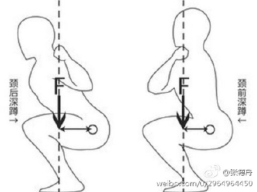

首先，我认为这根本就不是个问题，但不知道为什么还有人纠结于。如果你身边有人和你说深蹲膝盖不能过脚尖，而且他说不出任何理由，那他或她对你所说的大部分健身知识你应该持怀疑态度！

深蹲不能过脚尖是个误区，虽然不完全错，但对大部分人而言没有多大参考价值。有研究表明，减小胫骨倾斜角度，减小膝关节向前移动的距离能减少对膝关节的压力，但并没有说这种压力超过了人所能承受的程度。如果在训练过程中一位地遵循不能过脚尖反而会带来一些不利的影响。第一个不利影响是严格限制膝关节活动范围会导致上身过度前倾，导致下背部压力过大，进一步导致下背部弯曲(这是训练所要避免的)，增加伤病的几率。第二就是会减少股四的参与，无法使用更大的重量进行训练。第三就是膝盖不过脚尖会导致半蹲的情况，半蹲的重量往往比全蹲重的多，这会导致许多人盲目加重，不是专业的人对动作把握不够准从而增加你受伤的风险;当然半蹲也有它训练的意义，但对99%的人来说不是太适合。

在健身房你会看到好多长腿妹只蹲一点，即所谓的浅蹲(quarter squat)，从而导致你明明想要翘臀，背上放上杠铃却不敢蹲下去。简单点说，浅蹲比半蹲轻松4倍，比全蹲轻松8倍。

1、站距:上身倾斜幅度相同的情况下，窄距相较于宽距而言，膝盖前移的距离会较大，也就是如果你采用窄距，全蹲的话，你的膝盖一定会过脚尖。
 研究表明，深蹲膝盖过脚尖导致膝盖损伤的风险率比篮球，足球还要低。
 掌握正确的姿势，找到发力感觉，不要盲目加重，找到自己的状态，不要担心这会对你造成风险。

2、不要抬脚后跟，平时多练练踝关节的灵活度

3、髋部屈肌拉伸，臀大肌的控制力(你的屁股很翘，但不一定控制力很强，可以通过拱桥练习臀大肌的控制力)
 每个人的身体构造不同，如果一个人的上身很长，脚却很短，那你让他还蹲不蹲了。

最后，我觉得这个话题不应该是在讨论的问题，如果你身边有人和你说深蹲膝盖不能过脚尖，不听他瞎叨叨，也不要和他辩论，呵呵就行。

推荐一个试探别人训练知识的方法:
 首先，你问他或她正式训练多长时间了，一般2到3年以上才有资格说你懂健身;这也是为什么别人问我健身方面的知识，我不会和他讲那么多，只会和他说个大概，应为我才健身1年多，知识还有待提高。如果他或她健龄小于2年，练的又不咋地，那就没有太多参考价值，交个朋友就行。
 其次，就是看他或她练的咋样，成果咋样。一般练的很好的都不会少于2到3年，所以参照上一条。