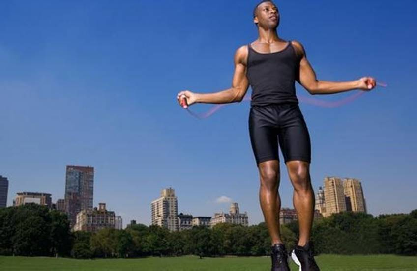
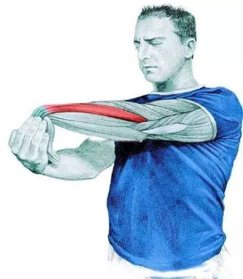
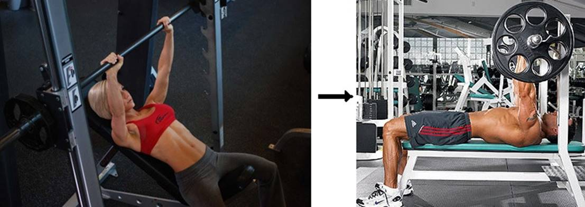
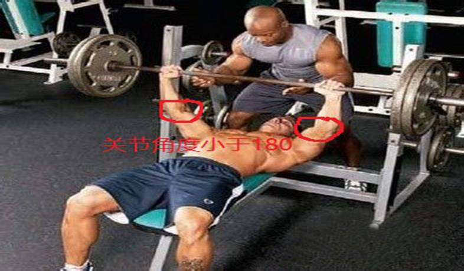
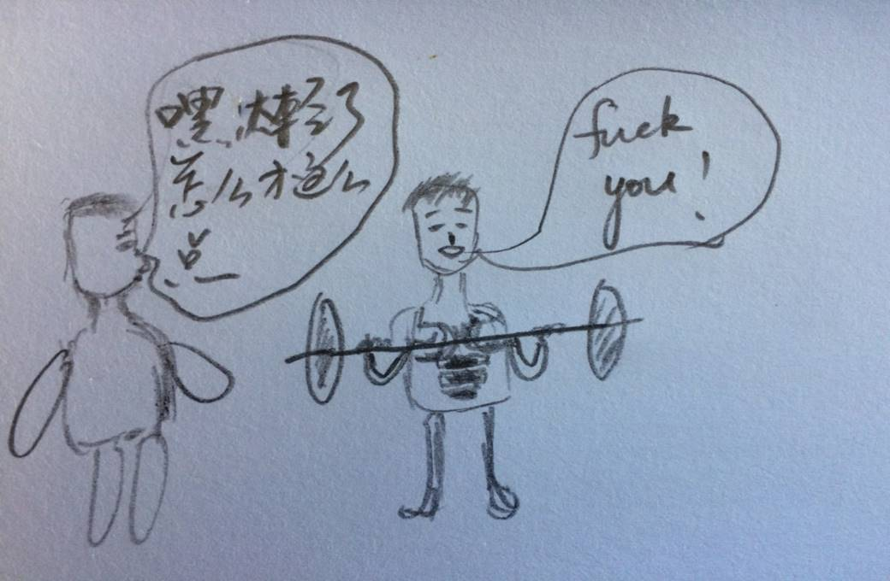
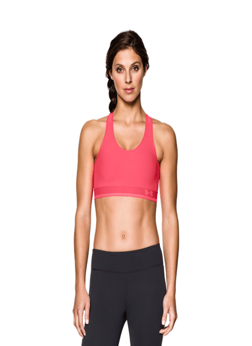
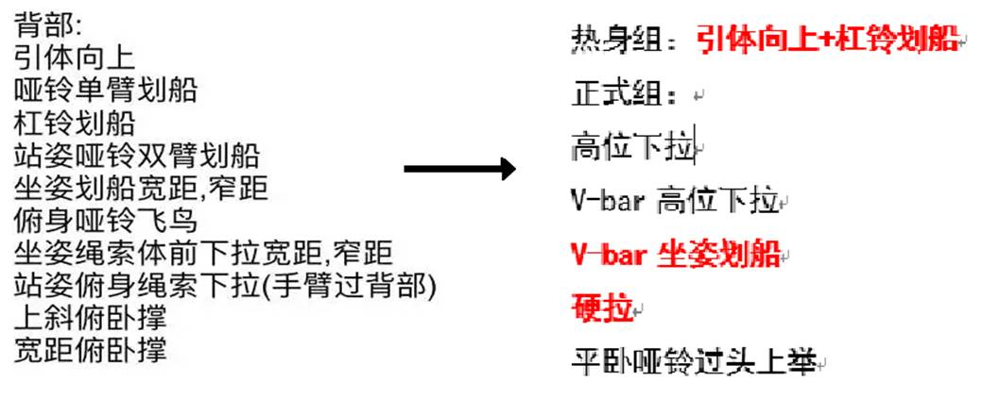

**训练小贴士：**

文章整理自平时训练笔记，若有不对之处，还望各路大神指教！

整理者：张德舟，微博ID：http://weibo.com/2964964450/profile?rightmod=1&wvr=6&mod=personinfo

 

**1.**   **训练之前的热身十分重要**

所谓热身，不像正式组那么紧张，强度也没那么大；但也不是囫囵吞枣，草草了事。

热身得让整个身体动起来（不要跟我说今天只练胸什么的，训练涉及的肌群很多，你得让大部分肌群先活动起来，然后针对目标机群做拉伸）。热身的形式很多，但目的都是为了给身体预热，你可以在跑步机上采用变速跑（速度和坡度同时改变，亲身体验过，很酸爽！），也可以使用弹力带，也可以尝试burpees等等。同时，在整个身体预热的过程中，针对几个比较大的目标肌群进行拉伸，可以更好地避免运动过程中的损伤。

**2.**   **练前，练后以及训练过程中的拉伸**

****

练前的拉伸在上面我有提到，训练过程中的拉伸也相当重要，不仅可以缓解肌肉酸痛（上次文章有提到，DOMS）,还能提高灵活度，为接下来的动作做准备。拉伸就在组间休息的时候进行，不要另外开辟时间给它。

**3.**   **尽可能多地使用自由器械，而不是动作轨迹固定的器械**

****

轨迹固定的器械最典型的就是史密斯机，当然轨迹固定的这些器械有它们不可替代的作用，但对于新手或者不是专业的选手而言，效果往往没有自由器械来的好。拿卧推来说，你用史密斯和自由卧推架完全是两个概念；史密斯能够推起更大的重量，对于胸部的孤立刺激比较到位，但动作轨迹相对固定（直上直下），手腕和肩部可能会有点不适，牵涉的肌群相对于自由架较少；而自由架不仅让胸部得到锻炼，同时能够让你在锻炼的过程中不断找到身体的平衡，提高身体的核心控制力，而且能够通过变换轨迹让三头等其他肌群有更多的参与，因此对于新手来说（或者说你还没达到一定的高度非要史密斯来刺激的地步），自由架对你来说是个优先的选择。

**4.**   **避免锁死关节**

锁死关节在训练过程中是可以避免的，只要稍加注意应该不难克服。锁死关节确实会对关节造成一定程度的损伤，特别上大重量的时候。

**5.**   **训练强度循序渐进，质量往往优于重量**

****

训练不要急于求成，不可能一下子减掉四五十公斤，也不可能一下子变得很壮大，这是个慢慢积累的过程。一开始先从最轻的来，慢慢加重，不要管别人怎么看。再说真正懂健身的人是不会嘲笑手举5磅哑铃的人的，那些嘲笑的人想必我不说你也知道他们是什么人了。

**6.**   **训练过程中的着装**

**** ****

不管什么时候，着装都是个很重要的环节；在训练过程中着装也很重要（**着装这边是我的个人观点，看看就行**）

**男士**：

下装：运动长裤或短裤（不要太短，太短了画风有点…，你又不是女生）+ 运动鞋

上装：运动长袖、短袖或背心（背心的选择应该慎重，不要穿了跟没穿一样，而且训练穿背心对训练者的身材要求很高，所以……）。

**女士：**

下装：运动长裤（紧身，宽松的都可以）或短裤 + 运动鞋

​    上装：运动长袖，T恤或者运动bra都可以

**强烈建议不要上身全裸**，健身房是公共场所，又不是你家，还有好多女士呢，最起码不要露点（女生除外，😀）！你裸着算怎么回事，一身膘晃来晃去的，显你膘多啊（不是歧视胖，只是说这么个道理）。

\7.   **训练过程中的基本礼貌**

**①****不要搞得器械上都是你的体液**

随身带条毛巾把你的汗擦一擦，当然尽量不要用你的毛巾去擦器械，一是器械本身就不干净，你毛巾还得擦脸呢，二是有些人不喜欢别人用自己的毛巾擦凳子什么的。所以最好每组锻炼开始和结束用毛巾把自己的汗擦擦就行了

**②****器械用完放回原处**

这个习惯老外做的很好，特别是专业的老外。但是在我去过的几个健身房很少看到有人这样做，当然我也正慢慢养成这个习惯。你搞的器械一团乱，别人找都找不到，特别是哑铃，用完了放到架子上。

**③****不摔杠铃片，不发出奇怪的呻吟**

每次训练的时候你都会听到一阵阵巨响，不是摔器械就是奇怪的呻吟。每次drop down的时候你就不能轻点（真正达到力竭状态实在干不动了情有可原），还有每次上大重量那些不和谐的呻吟总是让人很抓狂，你以为你这样很猛、很Man，其实往往会让干扰别人的训练，让别人讨厌你。

**④****每种器械占用时间尽量不超过15分钟，合理调度训练时间**

健身房的器械数量有限，特别是到高峰期常用的器械更加不够用，这时候你应该和别人协调好，可以和别人轮着来，或者临时调整你的动作顺序，不要傻等。时间是宝贵的，每天就那么多时间用来训练，哪有功夫在这些闲事上浪费时间。

**8.**   **训练计划中不要有太多选择**

针对身体每个肌群，训练的动作千变万化，因此要高效地选取那么几个动作即可，不要在训练计划中列入太多的选择，因为你根本来不及（切身体会）。训练时尽量多地选取复合动作，再加上一两个单关节动作强化一下目标机群。

如下图所示：由左图复杂繁多的动作转换为右图简单的几个动作，并加入符合关节动作

